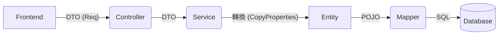

這是一份經過擴充的 `README.md`。

我保留了你原本清晰的架構定義，並新增了 **「🛠 核心開發規範 (Lombok 註解)」** 與 **「🧬 繼承結構」** 的章節。這對於未來維護非常有幫助，能讓開發者一眼就知道為什麼要加這麼多註解。

---

# Entity Package (資料庫實體層)

本 package 存放與資料庫表格 (Database Tables) **一對一對應** 的 Java 物件 (POJOs)。

## 📌 定義與職責

**Entity (實體)** 代表的是「資料庫的形狀」。
它的屬性名稱、型別，必須與資料庫中的 Table Schema 完全一致。

* **職責**：負責在 Java 程式與 Database 之間傳遞資料。
* **使用者**：主要由 `Mapper (MyBatis)` 與 `Service` 層使用。
* **禁止事項**：**不建議**直接將 Entity 回傳給前端 (API Response)，以避免暴露資料庫結構或敏感資訊（如 `firebaseUid`）。

## 🏗 架構位置

在分層架構中，Entity 位於最底層的資料核心：



---

## 🛠 核心開發規範 (Lombok 註解)

為了簡化程式碼並支援繼承結構，所有 Entity **必須** 標註以下 Lombok 註解：

### 1. 標準註解組合

```java
@Data
@SuperBuilder
@NoArgsConstructor
@AllArgsConstructor
@EqualsAndHashCode(callSuper = true)
public class UserPortfolio extends UserBaseEntity { ... }

```

### 2. 註解詳細說明

| 註解 | 必要性 | 用途說明 |
| --- | --- | --- |
| **`@Data`** | ✅ 必備 | 自動產生 `Getter`, `Setter`, `ToString`, `Equals`, `HashCode`。MyBatis 依賴 Setter 將資料寫入物件。 |
| **`@SuperBuilder`** | ✅ 必備 | **支援繼承的 Builder 模式**。因為我們繼承了 `UserBaseEntity`，必須使用 SuperBuilder 才能在建構時設定父類別欄位 (如 `id`, `firebaseUid`)。 |
| **`@NoArgsConstructor`** | ✅ 必備 | 產生無參數建構子。**MyBatis 與 Reflection 機制必須使用此建構子**來實例化物件。 |
| **`@AllArgsConstructor`** | ✅ 必備 | 產生全參數建構子。這是 **Builder 模式背後運作所需要**的建構子。 |
| **`@EqualsAndHashCode`** | ✅ 必備 | 設定 `callSuper = true`。強制 Lombok 在比對物件時，**同時比對父類別的欄位 (如 ID)**。若不加此行，ID 不同但內容相同的兩個物件會被視為相等 (Bug)。 |

---

## 🧬 繼承結構 (UserBaseEntity)

為了符合 **DRY (Don't Repeat Yourself)** 原則，所有與使用者相關的表格都應繼承 `UserBaseEntity`。

### 父類別：UserBaseEntity

包含所有表格共用的標準欄位，統一管理以避免重複定義。

* **`id` (PK)**: 資料庫流水號 (PostgreSQL `BIGSERIAL`)。
* **`firebaseUid`**: 資料歸屬的使用者 ID (用於權限控管)。
* **`createdAt`**: 建立時間。
* **`updatedAt`**: 更新時間 (由 DB Trigger 自動維護)。

### 開發範例

```java
@Data
@SuperBuilder // ⚠️ 父子類別都要加 SuperBuilder
@NoArgsConstructor
@AllArgsConstructor
@EqualsAndHashCode(callSuper = true) // ⚠️ 記得比對父類別
public class UserRealEstate extends UserBaseEntity {
    
    // 只需定義該表獨有的業務欄位
    private String name;
    private BigDecimal price;
    // ...
}

```

---

## 📝 PostgreSQL 注意事項

本專案使用 PostgreSQL，針對時間欄位有特殊處理：

1. **自動更新**：`updated_at` 欄位由資料庫 Trigger (`update_modified_column`) 自動維護。
2. **Java 端處理**：在執行 Update 操作時，Java **不需要** 手動 set 時間，DB 會自動處理。